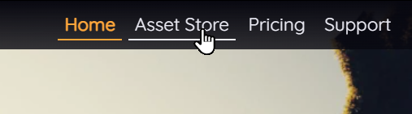
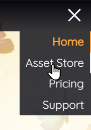
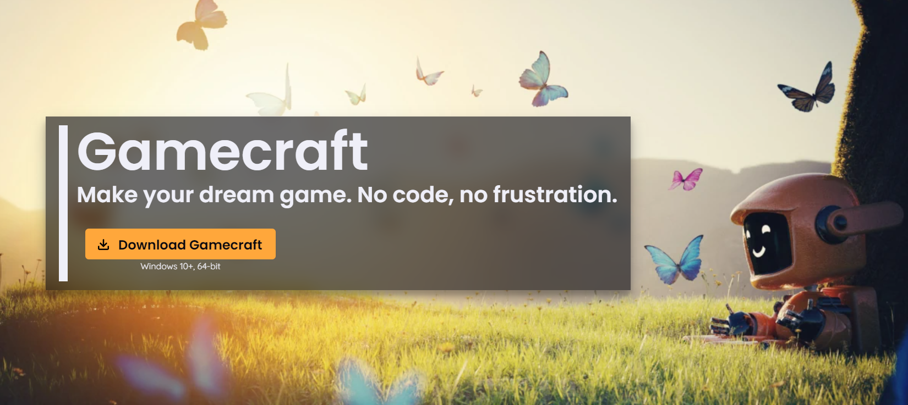
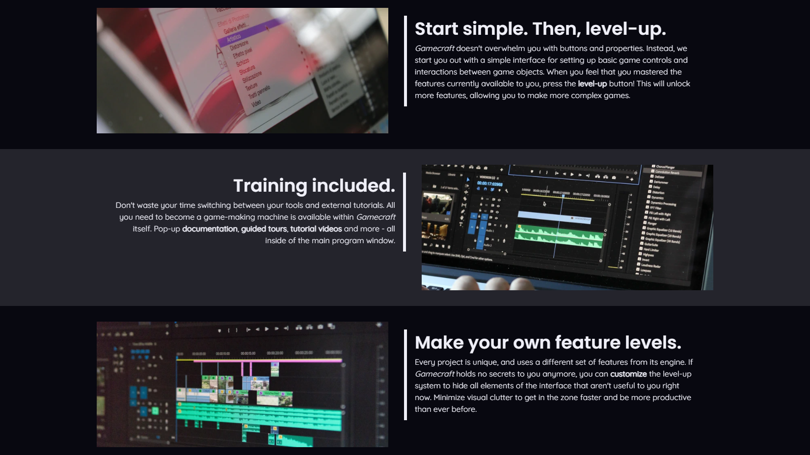
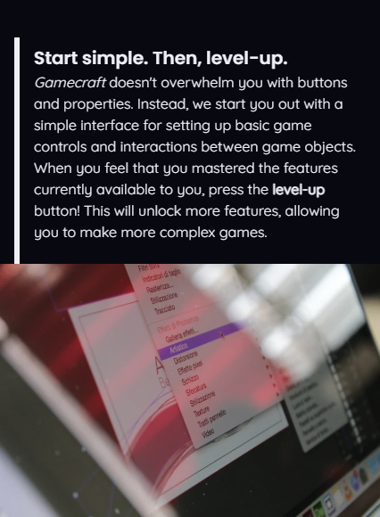
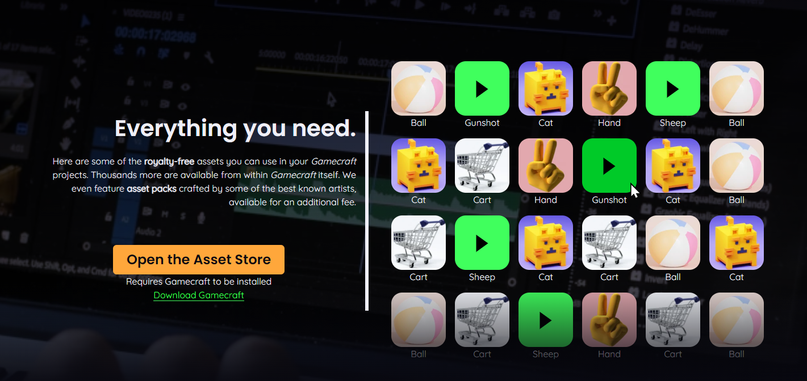
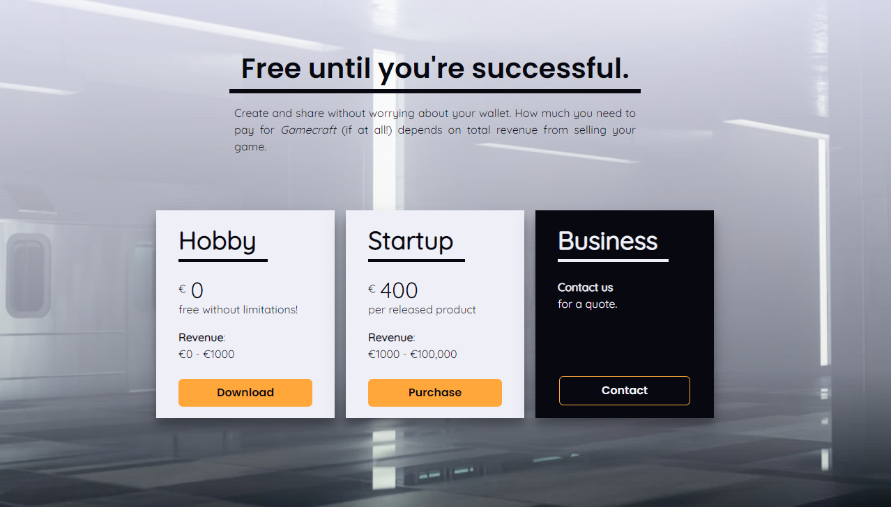
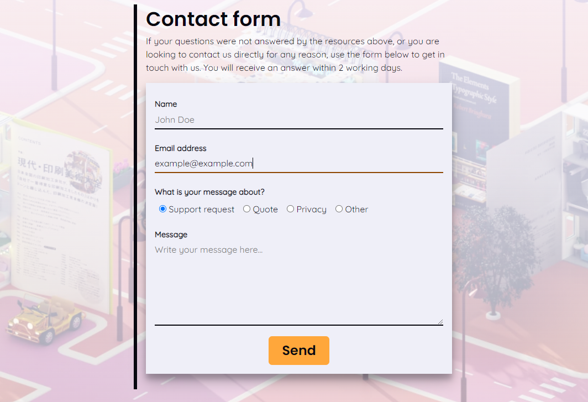

# Gamecraft: a portfolio website

This is a static website for a fictional videogame creation tool called _Gamecraft_, made for [Code Institute](https://codeinstitute.net)'s 1st submission project.

[Live version is available here.](https://tearnote.github.io/gamecraft-website/)

## Important notes

The site features both internal and external links. Since Gamecraft doesn't actually exist, the external links are intentionally non-functional, and are only there to make the site look more believable. You can identify these links on desktop by the cursor changing to the "forbidden" sign when you hover over the link.

For the same reason, images of Gamecraft features and example projects are stock images rather than real screenshots.

[DESIGN.md](doc/DESIGN.md): UX design notes crafted during early stages of development. The design process is described entirely, from basic premise and market research, through information structuring to visual design principles and color palettes.

[TESTING.md](doc/TESTING.md): Testing procedures. The site has been automatically validated and manually tested with procedures noted down in this file.

## Highlights

Site can be navigated using the sticky header (which collapses into a hamburger menu on smaller screens,) as well as inline links to related content.

The eye-catch section features an attractive scrolling image behind a clear statement of purpose and immediate call to action.

The features section lists the most important points that distinguish the product from the competition.

The website's design changes dynamically depending on screen size, all the way down to 320px.

The footer section lists all internal and external links and important section anchors together, as well as business details.

The Asset Store page showcases thumbnails of some 3D models featured in the product, with a link to access the full store within the product itself.

The Pricing page features a pricing table with clearly defined tiers.

The Support page contains a contact form, with field validation and browser auto-complete support. The form is sent to a "form dump" endpoint.

## Technologies

-   HTML5
    -   Semantic tags used whenever applicable
    -   [Images](#attribution) served as WebP for smaller download size
    -   [Fonts](doc/DESIGN.md#design-language) from Google Fonts
    -   No redundant containers for styling purposes
-   CSS3
    -   Layout with Flexbox and border-box sizing
    -   Transitions and animations to make interaction more pleasant
    -   Box shadows, gradients and backdrop filters to help with text readability and intuitive flow
    -   Media queries for responsive design

The site uses no frameworks, and the only externally loaded resources are the fonts. WebP images are exported with lossy compression set to 90. All code and text files are formatted with [Prettier](https://prettier.io), with indentation using tabs (not spaces.) The CSS is split into sections with `#section` markers, which can be collapsed in most IDEs and code editors.

The compatibility goal was all commonly used desktop and mobile browsers, updated to the latest or second-latest version. In particular, this means no compatibility with IE11, since it is [out of general support](https://learn.microsoft.com/en-us/lifecycle/faq/internet-explorer-microsoft-edge#what-is-the-lifecycle-policy-for-internet-explorer-) since June 15, 2022. The service [Can I use?](https://caniuse.com) was used to ensure that the compatibility goal is met.

Directory structure

   - `/` (root): HTML files, `README.md`, environment configuration
   - `assets/css`: CSS files
   - `assets/images`: WebP images served by the HTML pages
   - `assets/icons`: SVG images used as icons by the HTML pages
   - `doc`: Additional Markdown files, PNG images used by Markdown files, any additional documentation files

## Deployment

As this is a fully static website (no server component), it can be trivially deployed to any file hosting service. For the purpose of this project, the [live version](https://tearnote.github.io/gamecraft-website/) is deployed via GitHub Pages.

## Bugs

A few issues were encountered during development, they are documented below.

-   **Form autocomplete doesn't match page style**  
    This is caused by browser-specific styles overriding the CSS when the browser's autocompletion feature is used. The solution would require research for the right CSS vendor prefixes to use to style the form controls during autocomplete, and there wasn't time to look deeper into this during project time. A workaround of setting form controls to "light mode" was applied, which improved text legibility in this situation.
-   **Hamburger menu doesn't have the backdrop blur effect**  
    The area behind the hamburger navigation was not blurred, even though the whole header had the property applied, and the header is a parent of the navigation. This resulted in a minor decrease to legibility of the navigation on mobile screens in some scenarios. Was not able to find the cause during project time. As a workaround, a darker background was applied to the header and the navigation, replacing the blur effect entirely.
-   **Button outline on click effect not working on mobile in some cases**  
    Works on some buttons, but not others. Cause is unknown, as it works on desktop even with the same simulated screen size. Most likely a rendering quirk. Very little impact, since the focus state is less relevant on mobile.

## Attribution

All external code snippets are attributed inline.

Stock images

-   `hero.webp` by [Patricio González](https://pixabay.com/users/patolenin-991181/?utm_source=link-attribution&utm_medium=referral&utm_campaign=image&utm_content=6741424) from [Pixabay](https://pixabay.com//?utm_source=link-attribution&utm_medium=referral&utm_campaign=image&utm_content=6741424)
-   `feature1.webp` by [Stefano Intintoli](https://unsplash.com/@stefano_intintoli?utm_source=unsplash&utm_medium=referral&utm_content=creditCopyText) on [Unsplash](https://unsplash.com/?utm_source=unsplash&utm_medium=referral&utm_content=creditCopyText)
-   `feature2.webp` by [Matthew Kwong](https://unsplash.com/@mattykwong1?utm_source=unsplash&utm_medium=referral&utm_content=creditCopyText) on [Unsplash](https://unsplash.com/?utm_source=unsplash&utm_medium=referral&utm_content=creditCopyText)
-   `feature3.webp` by [Wahid Khene](https://unsplash.com/@wahidkhene?utm_source=unsplash&utm_medium=referral&utm_content=creditCopyText) on [Unsplash](https://unsplash.com/?utm_source=unsplash&utm_medium=referral&utm_content=creditCopyText)
-   `feature4.webp` by [Ralston Smith](https://unsplash.com/@ralstonhsmith?utm_source=unsplash&utm_medium=referral&utm_content=creditCopyText) on [Unsplash](https://unsplash.com/?utm_source=unsplash&utm_medium=referral&utm_content=creditCopyText)
-   `gallery1.webp` by [Raghav Verma](https://unsplash.com/@ragv_v?utm_source=unsplash&utm_medium=referral&utm_content=creditCopyText">) on [Unsplash](https://unsplash.com/?utm_source=unsplash&utm_medium=referral&utm_content=creditCopyText)
-   `gallery2.webp` by [Pramod Tiwari](https://unsplash.com/@pramodtiwari?utm_source=unsplash&utm_medium=referral&utm_content=creditCopyText) on [Unsplash](https://unsplash.com/?utm_source=unsplash&utm_medium=referral&utm_content=creditCopyText)
-   `gallery3.webp` by [Nick Brunner](https://unsplash.com/@nickbrunner?utm_source=unsplash&utm_medium=referral&utm_content=creditCopyText) on [Unsplash](https://unsplash.com/?utm_source=unsplash&utm_medium=referral&utm_content=creditCopyText)
-   `gallery4.webp` by [Anita Chong](https://unsplash.com/@jacutanita?utm_source=unsplash&utm_medium=referral&utm_content=creditCopyText) on [Unsplash](https://unsplash.com/?utm_source=unsplash&utm_medium=referral&utm_content=creditCopyText)
-   `ball.webp` by [Rodion Kutsaiev](https://www.pexels.com/photo/white-yellow-and-blue-ball-8566875/)
-   `cart.webp` by [emirhan bal](https://pixabay.com/users/7898250-7898250/?utm_source=link-attribution&utm_medium=referral&utm_campaign=image&utm_content=3248226) from [Pixabay](https://pixabay.com//?utm_source=link-attribution&utm_medium=referral&utm_campaign=image&utm_content=3248226)
-   `cat.webp` by [Andy Hermawan](https://unsplash.com/@kolamdigital?utm_source=unsplash&utm_medium=referral&utm_content=creditCopyText) on [Unsplash](https://unsplash.com/?utm_source=unsplash&utm_medium=referral&utm_content=creditCopyText)
-   `hand.webp` by [cottonbro CG studio](https://www.pexels.com/photo/persons-hand-doing-peace-sign-8832763/)

[SVG icons](assets/icons): [CSS.gg](https://css.gg/)
