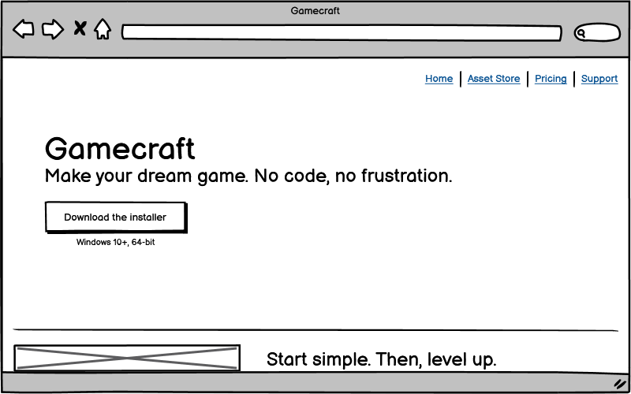
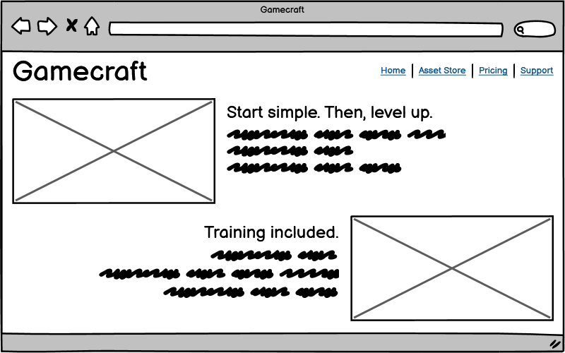
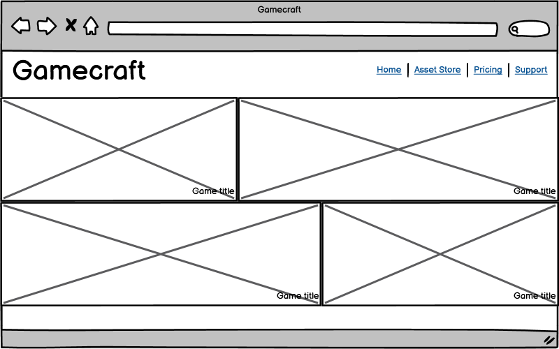
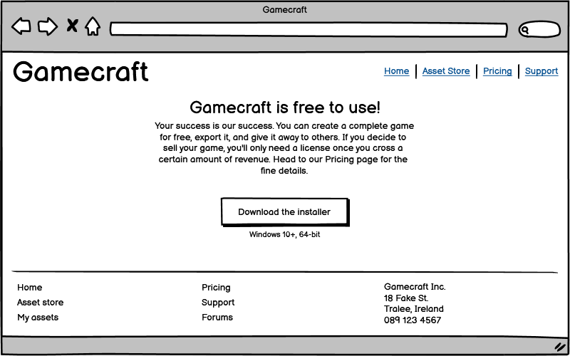
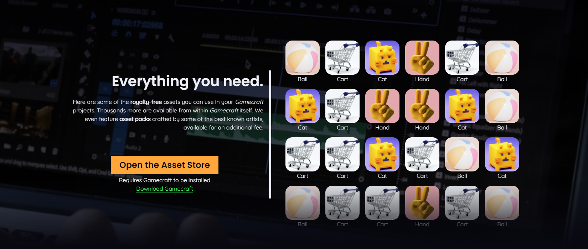
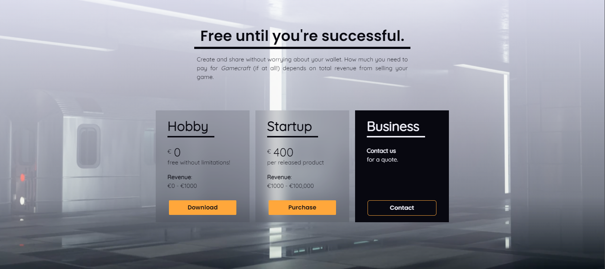
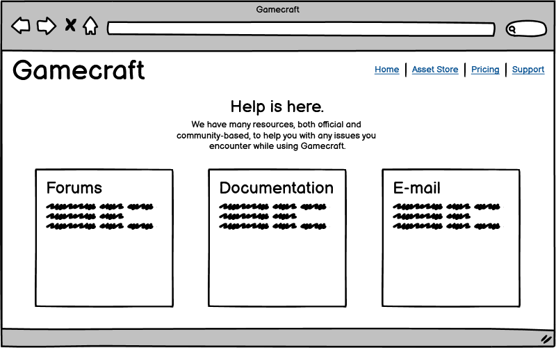
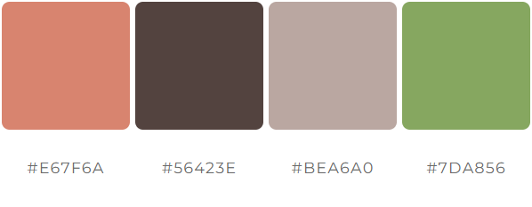

# Gamecraft: a portfolio website

This is a static website for a fictional videogame creation tool called *Gamecraft*. This imaginary program runs on Windows, and allows anyone to create a videogame though a fully visual interface rather than by writing lines of code. An asset store with a wealth of free content is also available, so the user doesn't need to be a visual artist or sound designer either. All that's needed is an idea and a bit of effort.

## Motivation

Most people who play videogames want to create one themselves at some point. However, the need to learn a programming language and use complicated engines discourages the majority of them from ever giving it a try. Even tools meant for less technical users often overwhelm beginners with countless menus and buttons, and can only be deciphered through persistence and video tutorials. There is a market gap for a program which focuses on learnability as its core principle, and this is the gap that Gamecraft aims to fill. This needs to be accomplished without sacrificing the feature set or reducing attractiveness to more experienced creators.

## Market research

There are a few established competitors in this field, such as:

 - [Construct](https://www.construct.net/en), an simple videogame creation tool that runs in the browser,
 - [RPG Maker](https://www.rpgmakerweb.com), an engine for grid-based RPG games,
 - [Game Maker](https://gamemaker.io/en), a graphical 2D game creation program,
 - [Unity](https://unity.com/solutions/game), a powerful engine for high-end multimedia games and applications,
 - [Unreal Engine](https://www.unrealengine.com/en-US), an engine powering cutting edge graphics and digital worlds.

Their websites are generally modern and attractive while maintaining conventional UX. As a result, they're easy to parse for facts and the user is smoothly guided through product features to the call to action. Because their designs all follow the same principles and they are transparent about product features rather than trying to attract users with meaningless slogans and buzzwords, the sites feel reliable and the products are easy to compare against each other.

In particular, the commonly seen page sections are:

 - Header with the major navigation links,
 - Hero image or background video of projects created with the product,
 - Early call to action above the fold,
 - Links to training material and online documentation,
 - Feature showcase with images or animations of the feature in action,
 - Gallery of the most popular games made with the tool,
 - Testimonials from successful users,
 - Pricing and licensing details split into product tiers with a feature matrix,
 - Links to community resources,
 - Large, non-sticky footer with more detailed navigation and business / legal details.

## User stories

> *As a non-technical person and an aspiring videogame creator, I want to find the best engine out there so that I can create my dream game with no frustration.*

 - Can I make a videogame in this?
 - Is it going to be as confusing as the others?
 - Do I need to make my own graphics and sounds?
 - How much does it cost?
 - If I finish my game, can I sell it?
 - What do I do if I'm stuck with a problem?
 - How do I get started? Should I follow any tutorial alongside it?

> *As an experienced videogame designer, I'm looking for better game creation workflows so that I can improve my productivity.*

 - Is this a serious product?
 - Can you make something complex and professional looking in this?
 - Why would I want to switch from my current workflow to this?
 - Do I get timely support if I encounter a bug?
 - Where can I go in-depth on specific features?

## Project scope

To satisfy the target users, these goals are essential:

 - Clear navigation to all pages of the site,
 - An eye-catching above-the-fold experience inviting the user to find out more,
 - A list of features that focuses on the product being friendly and intuitive,
 - A way to immediately download the product installer,
 - A section with successful projects made with the product to showcase its capabilities,
 - Transparent pricing details,
 - Links to any supplementary resources,
 - Modern, responsive, compliant and accessible design.

These goals are not neccessary for a MVP, but would provide additional value:

 - A preview of the asset store, showing some of the content available inside the product,
 - A support page, linking all the ways the user can get help with the product,
 - Simple CSS transitions and animations to make the site more attractive and enjoyable to navigate,
 - Light image editing to improve consistency of the design.

The project is subject to these limitations:

 - The site will use only HTML and CSS (not Javascript,) so complex interactive widgets won't be possible,
 - Gamecraft is a fictional product, so images of features and projects must be replaced with stock alternatives,
 - The project must be finished in two weeks, so not all planned features might make it in.

## Site structure

To fit with the industry standard researched [above](#market-research), the site should mirror the structure of competing products. That is to say, the general structure is hub-and-spoke, with the frontpage serving as the main source of information, providing the user with product details, in order from a general overview to more specific as they scroll from top to bottom. Any section the user might want to know even more about links to a separage page which goes into extreme detail on the single specific feature.

The site will also link to a large number of resources which are not included in the portfolio website, such as the documentation, social media, forums, etc. These links are mock-up content, so they will be present and non-functional (but not broken.) They will be visually marked to make it obvious that the destination is not part of the portfolio project.

## Wireframes

### Home

### Asset store

### Pricing

### Support

## Design language

The majority of the site will use bright text on a dark background, which inspires confidence as it's the typical color scheme in productivity software. However, some sections of the site might invert this to accent a non-technical section, such as user support.

The color palette needs to feel pleasant and welcoming, to contrast the more clinical and professional feel of the competition. This can be achieved with warm, pastel colors. Here is the primary palette for the site:

Similarly, the font needs to be clear and inviting. The headers will use [Poppins SemiBold 600](https://fonts.google.com/specimen/Poppins) for its simple geometric forms, and the main content will use the highly legible [Quicksand Regular 400](https://fonts.google.com/specimen/Quicksand), which contrasts it with a thinner weight and friendly rounded strokes.

## Bugs

 - Cannot hide the header logo behind the hero image on the main page.
   
   Resolved by duplicating the logo outside of the `<header>` element, which created a new stacking context because of its `position: fixed` attribute. Sibling element selector is used to hide the other logo when the duplicate logo is present, keeping the `<header>` element identical on every page.

## Attribution

[Hero image](assets/images/hero.jpg): Image by [Patricio González]("https://pixabay.com/users/patolenin-991181/?utm_source=link-attribution&amp;utm_medium=referral&amp;utm_campaign=image&amp;utm_content=6741424") from [Pixabay]("https://pixabay.com//?utm_source=link-attribution&amp;utm_medium=referral&amp;utm_campaign=image&amp;utm_content=6741424")