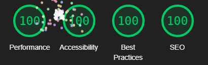

# Gamecraft: a portfolio website in pure HTML5+CSS3

This is a static website for a fictional videogame creation tool called _Gamecraft_, made for [Code Institute](https://codeinstitute.net)'s 1st submission project.

Live version is available [here](https://tearnote.github.io/gamecraft-website/).

## Notes

The site features both internal and external links. Since Gamecraft doesn't actually exist, the external links are intentionally non-functional, and are only there to make the site look more believable. You can identify these links on desktop by the cursor changing to the "forbidden" sign when you hover over the link.

For the same reason, images of Gamecraft features and example products are stock images.

UX design notes are available in [DESIGN.md](doc/DESIGN.md).

## Bugs

A few issues are present in the website, they will be documented below.

-   **Form autocomplete doesn't match page style**  
    This issue is caused by browser-specific styles overriding the form control styles when the autocompletion feature is used. The solution would require a lot of research for the right CSS vendor prefixes. Resolving this would take too much time for the benefit.

## Validation

The site was tested to work properly in latest Chrome, Firefox and Edge, as well as mobile Chrome. Several features are used that are incompatible with IE11, but this was judged not to be an issue because IE is now fully unsupported by Microsoft.

All project files validated successfully the with HTML checker and CSS checker at https://validator.w3.org/nu. HTML files have information-level alerts about redundant slash in self-closing tags. These are present because the recommended _Prettier_ formatting tool adds the slashes, without an option to turn it off.

Additionally, the CSS validation reports `mask` statements as invalid, such as:
```
mask: url(../icons/menu.svg) center/cover;
```
This appears to be a false positive related to `mask` shorthand parsing. The syntax is correct as per the formal definition at [MDN](https://developer.mozilla.org/en-US/docs/Web/CSS/mask#formal_syntax), the property validates (and still works the same) when split into 3 individual properties (`mask-image`, `mask-position` and `mask-size`), and the [GitHub issue](https://github.com/w3c/css-validator/issues/151) regarding CSS masking implementation in the validator is open, suggesting that the validator doesn't have full support for it yet.

The Lighthouse report shows a score of 100 in every category:



## Attribution

No frameworks are used. All external code snippets are attributed inline.

Stock images:

-   `hero.webp` by [Patricio González](https://pixabay.com/users/patolenin-991181/?utm_source=link-attribution&utm_medium=referral&utm_campaign=image&utm_content=6741424) from [Pixabay](https://pixabay.com//?utm_source=link-attribution&utm_medium=referral&utm_campaign=image&utm_content=6741424)
-   `feature1.webp` by [Stefano Intintoli](https://unsplash.com/@stefano_intintoli?utm_source=unsplash&utm_medium=referral&utm_content=creditCopyText) on [Unsplash](https://unsplash.com/?utm_source=unsplash&utm_medium=referral&utm_content=creditCopyText)
-   `feature2.webp` by [Matthew Kwong](https://unsplash.com/@mattykwong1?utm_source=unsplash&utm_medium=referral&utm_content=creditCopyText) on [Unsplash](https://unsplash.com/?utm_source=unsplash&utm_medium=referral&utm_content=creditCopyText)
-   `feature3.webp` by [Wahid Khene](https://unsplash.com/@wahidkhene?utm_source=unsplash&utm_medium=referral&utm_content=creditCopyText) on [Unsplash](https://unsplash.com/?utm_source=unsplash&utm_medium=referral&utm_content=creditCopyText)
-   `feature4.webp` by [Ralston Smith](https://unsplash.com/@ralstonhsmith?utm_source=unsplash&utm_medium=referral&utm_content=creditCopyText) on [Unsplash](https://unsplash.com/?utm_source=unsplash&utm_medium=referral&utm_content=creditCopyText)
-   `gallery1.webp` by [Raghav Verma](https://unsplash.com/@ragv_v?utm_source=unsplash&utm_medium=referral&utm_content=creditCopyText">) on [Unsplash](https://unsplash.com/?utm_source=unsplash&utm_medium=referral&utm_content=creditCopyText)
-   `gallery2.webp` by [Pramod Tiwari](https://unsplash.com/@pramodtiwari?utm_source=unsplash&utm_medium=referral&utm_content=creditCopyText) on [Unsplash](https://unsplash.com/?utm_source=unsplash&utm_medium=referral&utm_content=creditCopyText)
-   `gallery3.webp` by [Nick Brunner](https://unsplash.com/@nickbrunner?utm_source=unsplash&utm_medium=referral&utm_content=creditCopyText) on [Unsplash](https://unsplash.com/?utm_source=unsplash&utm_medium=referral&utm_content=creditCopyText)
-   `gallery4.webp` by [Anita Chong](https://unsplash.com/@jacutanita?utm_source=unsplash&utm_medium=referral&utm_content=creditCopyText) on [Unsplash](https://unsplash.com/?utm_source=unsplash&utm_medium=referral&utm_content=creditCopyText)
-   `ball.webp` by [Rodion Kutsaiev](https://www.pexels.com/photo/white-yellow-and-blue-ball-8566875/)
-   `cart.webp` by [emirhan bal](https://pixabay.com/users/7898250-7898250/?utm_source=link-attribution&utm_medium=referral&utm_campaign=image&utm_content=3248226) from [Pixabay](https://pixabay.com//?utm_source=link-attribution&utm_medium=referral&utm_campaign=image&utm_content=3248226)
-   `cat.webp` by [Andy Hermawan](https://unsplash.com/@kolamdigital?utm_source=unsplash&utm_medium=referral&utm_content=creditCopyText) on [Unsplash](https://unsplash.com/?utm_source=unsplash&utm_medium=referral&utm_content=creditCopyText)
-   `hand.webp` by [cottonbro CG studio](https://www.pexels.com/photo/persons-hand-doing-peace-sign-8832763/)

[SVG icons](assets/icons): [CSS.gg](https://css.gg/)
