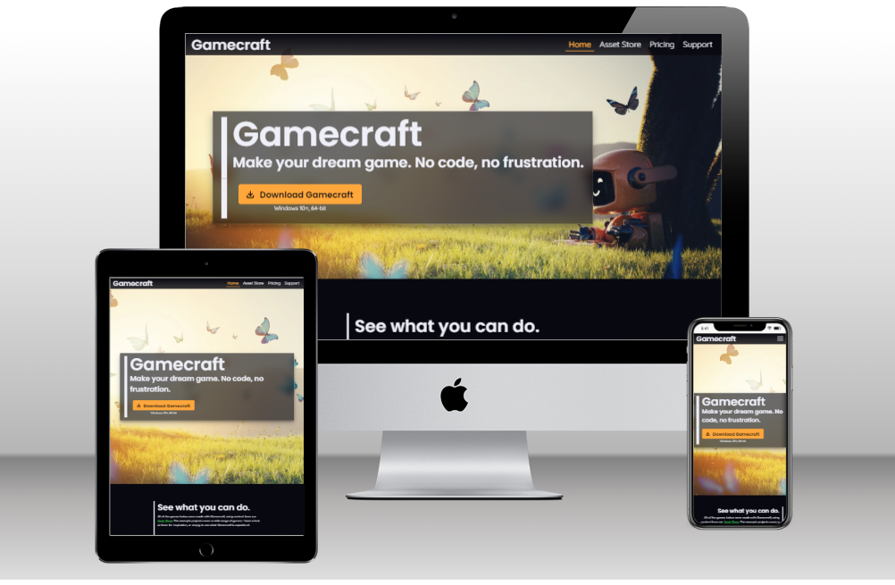

# Gamecraft: a portfolio website in pure HTML5+CSS3

This is a static website for a fictional videogame creation tool called _Gamecraft_, made for [Code Institute](https://codeinstitute.net)'s 1st submission project.

[Live version is available here.](https://tearnote.github.io/gamecraft-website/)

## Notes

The site features both internal and external links. Since Gamecraft doesn't actually exist, the external links are intentionally non-functional, and are only there to make the site look more believable. You can identify these links on desktop by the cursor changing to the "forbidden" sign when you hover over the link.

For the same reason, images of Gamecraft features and example projects are stock images rather than real screenshots.

UX design notes are available in [DESIGN.md](doc/DESIGN.md).

The testing procedures are described in [TESTING.md](doc/TESTING.md).

## Code conventions

The site uses no frameworks, and the only externally loaded resource is Google Fonts. Layout is done with Flexbox. Images are served in the WebP format, with lossy compression set to 90. All code and text files are formatted with [Prettier](https://prettier.io), with indentation using tabs (not spaces.) The CSS is split into sections with `#section` markers, which can be collapsed in most IDEs and code editors.

The compatibility goal was all commonly used desktop and mobile browsers, updated to the latest or second-latest version. In particular, this means no compatibility with IE11, since it is [out of general support](https://learn.microsoft.com/en-us/lifecycle/faq/internet-explorer-microsoft-edge#what-is-the-lifecycle-policy-for-internet-explorer-) since June 15, 2022. The service [Can I use?](https://caniuse.com) was used to ensure that the compatibility goal is met.

## Bugs

A few issues are present in the finished website, they will be documented below.

-   **Form autocomplete doesn't match page style**  
    This is caused by browser-specific styles overriding the CSS when the browser's autocompletion feature is used. The solution would require research for the right CSS vendor prefixes to use to style the form controls during autocomplete, and there wasn't time to look deeper into this during project time. A workaround of setting form controls to "light mode" was applied, which improved text legibility in this situation.
-   **Hamburger menu doesn't have the backdrop blur effect**  
    The area behind the hamburger navigation is not blurred, even though the whole header has the property applied, and the header is a parent of the navigation. This results in a minor decrease to legibility of the navigation on mobile screens in some scenarios. Was not able to find the cause during project time.

## Attribution

All external code snippets are attributed inline.

Stock images:

-   `hero.webp` by [Patricio González](https://pixabay.com/users/patolenin-991181/?utm_source=link-attribution&utm_medium=referral&utm_campaign=image&utm_content=6741424) from [Pixabay](https://pixabay.com//?utm_source=link-attribution&utm_medium=referral&utm_campaign=image&utm_content=6741424)
-   `feature1.webp` by [Stefano Intintoli](https://unsplash.com/@stefano_intintoli?utm_source=unsplash&utm_medium=referral&utm_content=creditCopyText) on [Unsplash](https://unsplash.com/?utm_source=unsplash&utm_medium=referral&utm_content=creditCopyText)
-   `feature2.webp` by [Matthew Kwong](https://unsplash.com/@mattykwong1?utm_source=unsplash&utm_medium=referral&utm_content=creditCopyText) on [Unsplash](https://unsplash.com/?utm_source=unsplash&utm_medium=referral&utm_content=creditCopyText)
-   `feature3.webp` by [Wahid Khene](https://unsplash.com/@wahidkhene?utm_source=unsplash&utm_medium=referral&utm_content=creditCopyText) on [Unsplash](https://unsplash.com/?utm_source=unsplash&utm_medium=referral&utm_content=creditCopyText)
-   `feature4.webp` by [Ralston Smith](https://unsplash.com/@ralstonhsmith?utm_source=unsplash&utm_medium=referral&utm_content=creditCopyText) on [Unsplash](https://unsplash.com/?utm_source=unsplash&utm_medium=referral&utm_content=creditCopyText)
-   `gallery1.webp` by [Raghav Verma](https://unsplash.com/@ragv_v?utm_source=unsplash&utm_medium=referral&utm_content=creditCopyText">) on [Unsplash](https://unsplash.com/?utm_source=unsplash&utm_medium=referral&utm_content=creditCopyText)
-   `gallery2.webp` by [Pramod Tiwari](https://unsplash.com/@pramodtiwari?utm_source=unsplash&utm_medium=referral&utm_content=creditCopyText) on [Unsplash](https://unsplash.com/?utm_source=unsplash&utm_medium=referral&utm_content=creditCopyText)
-   `gallery3.webp` by [Nick Brunner](https://unsplash.com/@nickbrunner?utm_source=unsplash&utm_medium=referral&utm_content=creditCopyText) on [Unsplash](https://unsplash.com/?utm_source=unsplash&utm_medium=referral&utm_content=creditCopyText)
-   `gallery4.webp` by [Anita Chong](https://unsplash.com/@jacutanita?utm_source=unsplash&utm_medium=referral&utm_content=creditCopyText) on [Unsplash](https://unsplash.com/?utm_source=unsplash&utm_medium=referral&utm_content=creditCopyText)
-   `ball.webp` by [Rodion Kutsaiev](https://www.pexels.com/photo/white-yellow-and-blue-ball-8566875/)
-   `cart.webp` by [emirhan bal](https://pixabay.com/users/7898250-7898250/?utm_source=link-attribution&utm_medium=referral&utm_campaign=image&utm_content=3248226) from [Pixabay](https://pixabay.com//?utm_source=link-attribution&utm_medium=referral&utm_campaign=image&utm_content=3248226)
-   `cat.webp` by [Andy Hermawan](https://unsplash.com/@kolamdigital?utm_source=unsplash&utm_medium=referral&utm_content=creditCopyText) on [Unsplash](https://unsplash.com/?utm_source=unsplash&utm_medium=referral&utm_content=creditCopyText)
-   `hand.webp` by [cottonbro CG studio](https://www.pexels.com/photo/persons-hand-doing-peace-sign-8832763/)

[SVG icons](assets/icons): [CSS.gg](https://css.gg/)
